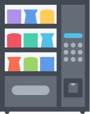

# vending-machine

Proyecto de Máquina de vending en Python

# UT4-TE1: Funciones

### TAREA EVALUABLE



## Objetivo

Escriba un programa en Python que permita gestionar una **MÁQUINA DE VENDING**.

## Datos de entrada

### Información inicial de la máquina

`vending.dat`

En la primera línea habrán 3 valores separados por espacios:

-   El primer valor corresponde al número de monedas de 2€.
-   El segundo valor corresponde al número de monedas de 1€.
-   El tercer valor corresponde al número de monedas de 50 céntimos (0.5€)

A partir de ahí, aparecen un número intederminado de líneas donde hay tres campos separados espacios:

-   Código del producto (D para "drinks" y F para "food").
-   Stock en máquina del producto.
-   Precio unitario del producto (en euros).

```
100 50 120
D31 20 0.50
D12 40 1
F19 33 1.50
F10 24 2
```

### Operaciones sobre la máquina

`operations.dat`

Existen 3 tipos de operaciones sobre la máquina de vending:

-   Pedido: se representa por el código `O` (Order). Tiene los siguientes argumentos separados por espacios:
    -   Código del producto.
    -   Cantidad solicitada.
    -   Monedas de 2€ insertadas.
    -   Monedas de 1€ insertadas.
    -   Monedas de 0.5€ insertadas.
-   Reposición de producto: se representa por el código `R` (Restock). Tiene los siguientes argumentos separados por espacios:
    -   Código del producto.
    -   Cantidad repuesta.
-   Recarga de monedas: se reprenseta por el código `C` (reload Coins). Tiene los siguientes argumentos separados por espacios:
    -   Tipo de moneda.
    -   Cantidad de monedas.
-   Cambio de precio: se representa por el código `P` (change Price). Tiene los siguientes argumentos separados por espacios:
    -   Código del producto.
    -   Nuevo precio unitario del producto (en euros).

```
O F19 4 3 1 0
R D12 7
O D31 4 0 1 2
P F10 2.5
C 1 4
```

## Datos de salida

`status.dat`

La salida deberá escribirse en un fichero `status.dat` con el mismo formato que el fichero `vending.dat` pero **con los productos ordenados por su código**.

Este fichero contendrá la situación de la máquina de vending después de aplicar las operaciones indicadas. Es decir, deberá mostrar las monedas y el stock que queda:

```
103 55 122
D12 47 1
D31 16 0.50
F10 24 2.5
F19 29 1.50
```

## Condiciones de error

Para cada operación hay que tener en cuenta que se puede producir alguna condición de error:

-   No existe el producto solicitado (también para reposición/cambio de precio).
-   No existe el tipo de moneda especificada en la recarga de monedas.
-   No hay stock suficiente para la cantidad solicitada de un producto.
-   El dinero introducido no es suficiente para pagar el total del pedido.
-   No queda cambio disponible.
-   Los precios de los productos tienen que ser manejables con monedas de 2€, 1€ y 0.5€.

Si una operación produce un error, se cancelará dicha operación pero se seguirá tratando el resto de operaciones pendientes.

## Notas

-   Utilizar sólo herramientas de Python que se hayan visto hasta el momento en clase.
-   Crear todas las funciones que se consideren necesarias.
-   Se puede asumir que todas las cantidades serán mayores o iguales que 0.
